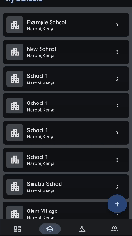
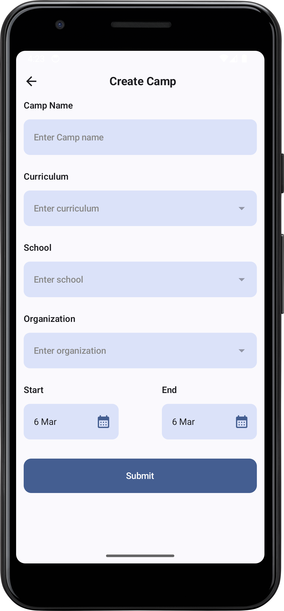

# GraphQL Android Project

This project is an Android application built using Kotlin and Jetpack Compose. It leverages GraphQL for data fetching and Koin for dependency injection.

## Screenshots

### Home Screen


### School




### Camp




## Setup Instructions

1. Clone the repository:
    ```sh
    git clone https://github.com/wallacesintra/qraphQLAndroid.git
    ```
2. Open the project in Android Studio.
3. Sync the project with Gradle files.
4. Run the project on an emulator.

## Features Implemented

- Home Screen
- School List Screen
- Camp List Screen
- Create School Page
- Create Camp Page

## Architecture Overview

The project follows the MVVM (Model-View-ViewModel) architecture pattern. The main components are:

- **Model**: Represents the data and business logic.
- **View**: UI components built using Jetpack Compose.
- **ViewModel**: Manages UI-related data and handles business logic.

## Libraries or Tools Used

- **Kotlin**: Programming language
- **Jetpack Compose**: UI toolkit
- **GraphQL**: Data fetching
- **Koin**: Dependency injection
- **SQLDelight** : Local database

## Challenges Faced

- **Testing**: I was not able to test all the view models and classes. I wrote some UI test and unit tests,  I followed the official documentation and examples to write tests for the application.
- **Complete feature implementation**: Due to time constraints, I was not able to implement all the features of the application. I don't implement the create student and display detailed info about a student features.
- **Complete UI**: Due to time constraints, I was not able to complete all the UI components and screens. I focused on implementing the core features of the application.
- **Dependency Injection**: Setting up Koin for dependency injection required some time to understand and implement correctly. I followed the official documentation and examples to set it up.
- **Navigation**: Implementing navigation in a Compose application required a different approach. I used `navController` to manage navigation between screens.
- **GraphQL Integration**: Integrating GraphQL required setting up the Apollo client and handling queries and mutations. We followed the Apollo documentation and examples to set it up correctly.

## Known Issues or Limitations

- **Error Handling**: Error handling is basic and needs improvement to provide better user feedback.
- **UI/UX**: Some UI components may not be fully optimized for different screen sizes and orientations.